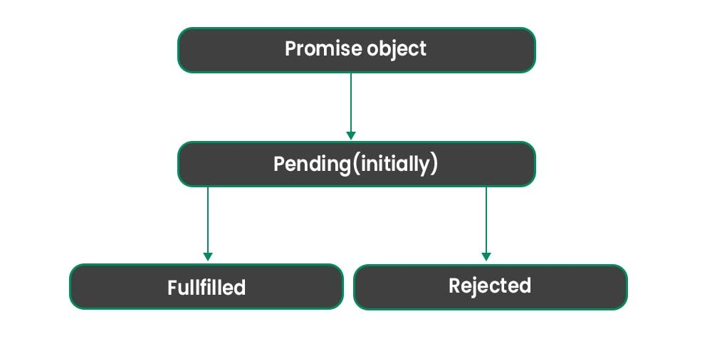

# JavaScript Promise
JavaScript Promises make handling asynchronous operations like API calls, file loading, or time delays easier. Think of a Promise as a placeholder for a value that will be available in the future. It can be in one of three states

1. Pending: The task is in the initial state.
2. Fulfilled: The task was completed successfully, and the result is available.
3. Rejected: The task failed, and an error is provided.

Here is an example Promise to check if a number is even. If yes, it resolves; otherwise, it rejects.
```bash
let checkEven = new Promise((resolve, reject) => {
    let number = 4;
    if (number % 2 === 0) resolve("The number is even!");
    else reject("The number is odd!");
});
checkEven
    .then((message) => console.log(message)) // On success
    .catch((error) => console.error(error)); // On failure

 ```
 Note: The “resolve” and “reject” are not keywords. you can use any name that you want to give to a function.

 #### Syntax
 ```bash
 let promise = new Promise((resolve, reject) => {
    // Perform async operation
    if (operationSuccessful) {
        resolve(“Task successful”);
    } else {
        reject(“Task failed”);
    }
});


```
* resolve(value): Marks the promise as fulfilled and provides a result.
* reject(error): Marks the promise as rejected with an error.

Let’s See Advanced Promise Methods and Patterns for Effective Async Handling

### 1. Promise.all() Method
Waits for all promises to resolve and returns their results as an array. If any promise is rejected, it immediately rejects.
```bash
Promise.all([
    Promise.resolve("Task 1 completed"),
    Promise.resolve("Task 2 completed"),
    Promise.reject("Task 3 failed")
])
    .then((results) => console.log(results))
    .catch((error) => console.error(error));

output:
Task 3 failed

```

### 2. Promise.allSettled() Method
Waits for all promises to settle (fulfilled or rejected) Method and returns an array of their outcomes.
```bash
Promise.allSettled([
    Promise.resolve("Task 1 completed"),
    Promise.reject("Task 2 failed"),
    Promise.resolve("Task 3 completed")
])
    .then((results) => console.log(results));

output:
[
  { status: 'fulfilled', value: 'Task 1 completed' },
  { status: 'rejected', reason: 'Task 2 failed' },
  { status: 'fulfilled', value: 'Task 3 completed' }
]

```   

### 3. Promise.race() Method
Promise.race() Method resolves or rejects as soon as the first promise settles.
```bash
Promise.race([
    new Promise((resolve) =>
        setTimeout(() =>
            resolve("Task 1 finished"), 1000)),
    new Promise((resolve) =>
        setTimeout(() =>
            resolve("Task 2 finished"), 500)),
]).then((result) =>
    console.log(result));

output:
Task 2 finished

 ```

 ### 4. Promise.any() Method
Promise.any() Method resolves with the first fulfilled promise. If all are rejected, it rejects with an AggregateError.
```bash
Promise.any([
    Promise.reject("Task 1 failed"),
    Promise.resolve("Task 2 completed"),
    Promise.resolve("Task 3 completed")
])
    .then((result) => console.log(result))
    .catch((error) => console.error(error));

 output:
 Task 2 completed

```

### 5. Promise.resolve() Method
Promise.resolve() Method returns a promise that resolves with the given value.
```bash
Promise.resolve("Immediate success")
    .then((value) => console.log(value));

output:
Immediate success

```   

### 6. Promise.reject() Method
Promise.reject() Method returns a promise that immediately rejects with a given reason.

```bash
Promise.reject("Immediate failure")
    .catch((error) => console.error(error));

output:
Immediate failure
```

### 7. Promise.finally() Method
Promise.finally() Method runs a cleanup or final code block regardless of the promise’s result (fulfilled or rejected).
```bash
Promise.resolve("Task completed")
    .then((result) => console.log(result))
    .catch((error) => console.error(error))
    .finally(() => console.log("Cleanup completed"));

output:
Task completed
Cleanup completed

```

### 8. Chaining with Promise.prototype.then() Method
Allows sequential execution of promises, passing results to the next .then() Method.
```bash
Promise.resolve(5)
    .then((value) => value * 2) // Multiplies by 2
    .then((value) => value + 3) // Adds 3
    .then((finalValue) => console.log(finalValue)); // Logs: 13

output:
13

```

### 9. Sequential Execution with Array.prototype.reduce()
```bash
let tasks = [1, 2, 3];
tasks.reduce((prevPromise, current) => {
    return prevPromise.then(() => {
        return new Promise((resolve) => {
            console.log(`Processing task ${current}`);
            setTimeout(resolve, 500); // Simulate async task
        });
    });
}, Promise.resolve());

output:
Processing task 1
Processing task 2
Processing task 3

```

### 10. Dynamic Promise Creation
Creating and resolving promises dynamically for runtime-based decisions.
```bash
function asyncTask(taskName) {
    return new Promise((resolve) => {
        setTimeout(() => 
            resolve(`${taskName} completed`), 1000);
    });
}
asyncTask("Download File").then((result) => 
    console.log(result));

output:
 Download File completed
```


### 11. Timeout Handling with Promise.race() Method
Using Promise.race() Method to set a timeout for a task.
```bash
let fetchData = new Promise((resolve) =>
    setTimeout(() =>
        resolve("Data loaded"), 3000));
let timeout = new Promise((_, reject) =>
    setTimeout(() =>
        reject("Timeout!"), 2000));
Promise.race([fetchData, timeout])
    .then((result) =>
        console.log(result))
    .catch((error) =>
        console.error(error));
output:
Timeout!

 ```  

 ### 12. Handling Multiple Failures with Promise.allSettled() Method
Works when you need to process all results, even if some promises fail.
```bash
Promise.allSettled([
    Promise.resolve("Task 1 done"),
    Promise.reject("Task 2 failed"),
    Promise.resolve("Task 3 done")
])
    .then((results) => console.log(results));

output:
[
  { status: 'fulfilled', value: 'Task 1 done' },
  { status: 'rejected', reason: 'Task 2 failed' },
  { status: 'fulfilled', value: 'Task 3 done' }
]


```

### 13. Combining Promises with Parallel and Sequential Execution
Run some promises in parallel, then process their results sequentially.
```bash
Promise.all([
    new Promise((resolve) =>
        setTimeout(() =>
            resolve("Task A done"), 1000)),
    new Promise((resolve) =>
        setTimeout(() =>
            resolve("Task B done"), 500))
])
    .then(([resultA, resultB]) => {
        console.log(resultA, resultB);
        return new Promise((resolve) =>
            setTimeout(() => resolve("Final Task done"), 700));
    })
    .then((finalResult) =>
        console.log(finalResult));

output:
Task A done Task B done
Final Task done        
```        


### 14. Wrapping Callbacks into Promises
Convert callback-based async functions into promises.
```bash
function loadData(callback) {
    setTimeout(() => 
        callback("Data loaded"), 1000);
}
function promisifiedLoadData() {
    return new Promise((resolve) => {
        loadData((result) => 
            resolve(result));
    });
}
promisifiedLoadData().then((data) => 
    console.log(data));

output:
Data loaded


```

# JavaScript Promise Chaining
Promise chaining allows you to execute a series of asynchronous operations in sequence. It is a powerful feature of JavaScript promises that helps you manage multiple operations, making your code more readable and easier to maintain.

1. Allows multiple asynchronous operations to run in sequence.
2. Reduces callback hell by eliminating deeply nested functions.
3. Each then() returns a new promise, allowing further chaining.
4. Error handling is easier with a single .catch() for the entire chain.

Why Use Promise Chaining?
1. Improved Readability: Makes code cleaner and easier to understand compared to deeply nested callbacks.
2. Error Handling: Centralized error management with a single .catch() for the entire chain.
3. Sequential Execution: Ensures tasks are executed one after the other, passing results along.
4. Simplifies Dependencies: Handles tasks that depend on the output of previous asynchronous operations.
5. Enhanced Debugging: Stack traces in Promise chains are easier to follow compared to callback chains.


```bash
function task(message, delay) {
    return new Promise((resolve) => {
        setTimeout(() => {
            console.log(message);
            resolve();
        }, delay);
    });
}

// Chaining promises
task('Task 1 completed', 1000)
    .then(() => task('Task 2 completed', 2000))
    .then(() => task('Task 3 completed', 1000));

output:
Task 1 completed
Task 2 completed
Task 3 completed

```    
**In this example:**
* task() is a function that returns a promise, simulating a delay using setTimeout.
* Each task waits for the previous one to complete before executing, thanks to the .then() chaining.
* The tasks will execute in order, printing:
1. “Task 1 completed”
2. “Task 2 completed”
3. “Task 3 completed”
* This is the core of promise chaining, where each promise is linked to the next one through .then()

### Promise States
A promise in JavaScript can be in one of three states, which determine how it behaves:

* Pending: This state represents the initial state of the promise. It is neither fulfilled nor rejected.
* Fulfilled: This state represents that the asynchronous operation has successfully completed, and the promise has resolved with a value.
* Rejected: This state represents that the asynchronous operation has failed, and the promise has rejected with a reason (error).



### Error Handling in Chaining
```bash
Promise.resolve(5)
    .then((num) => {
        console.log(`Value: ${num}`);
        throw new Error("Something went wrong!");
    })
    .then((num) => {
        console.log(`This won't run`);
    })
    .catch((error) => {
        console.error(`Error: ${error.message}`);
    });

output:
Value: 5
Error: Something went wrong!

```   

### Chaining with Dependent Tasks
```bash
function fetchUser(userId) {
    return Promise.resolve({ id: userId, name: "GFG" });
}

function fetchOrders(user) {
    return Promise.resolve([{ orderId: 1, userId: user.id }]);
}

fetchUser(101)
    .then((user) => {
        console.log(`User: ${user.name}`);
        return fetchOrders(user);
    })
    .then((orders) => {
        console.log(`Orders: ${orders.length}`);
    })
    .catch((error) => console.error(error));

output:
User: GFG
Orders: 1

 ```   

 ### Advanced Usage: Parallel and Sequential Tasks in a Chain
You can combine Promise.all() with chaining for efficient execution.
```bash
Promise.all([
    Promise.resolve("Task 1 done"),
    Promise.resolve("Task 2 done")
])
    .then(([result1, result2]) => {
        console.log(result1, result2);
        return Promise.resolve("Final Task done");
    })
    .then((finalResult) => console.log(finalResult))
    .catch((error) => console.error(error));

output:
Task 1 done Task 2 done
Final Task done
```