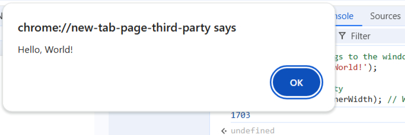
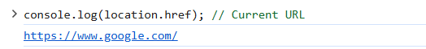

# JavaScript - Browser Object Model
The Browser Object Model (BOM) in JavaScript enables developers to interact with the browser beyond just the webpage content, offering control over essential features such as the browser window, URL (location), and browsing history.

## Browser Object Model in JavaScript
The Browser Object Model (BOM) in JavaScript helps to interact with the browser, not just the webpage. While the DOM handles the content of the page, BOM gives you control over things like the browser window, the URL, and the history. This means you can do things like resize the window, go back and forth in the browser history, or even find out what browser the user is using. In short, BOM helps JavaScript work with the browser to make web pages more interactive.

### Browser Object Model Types
Here are the main parts of the Browser Object Model (BOM)

| **Object**  | **Description**                                                                                      |
| ----------- | ---------------------------------------------------------------------------------------------------- |
| `window`    | Represents the browser window, controls aspects like size/location, and serves as the global object. |
| `navigator` | Provides details about the user's browser and operating system.                                      |
| `location`  | Manages the current URL; allows getting or changing the web address.                                 |
| `screen`    | Offers information about the user's screen, such as width and height.                                |
| `history`   | Gives access to the browser's session history, allowing navigation back/forward.                     |


### 1. Window Object
The window object is the main object in the BOM, representing the browser window or tab itself. It's the top-level object, and everything else in the browser is contained within it.

```bash
window.alert('Hello, World!');
console.log(window.innerWidth); 


```
* The window object provides methods like alert(), confirm(), and prompt().
* It also gives you access to other important objects, such as document, navigator, screen, location, and history.




### 2. Navigator Object
The navigator object provides information about the browser and the user's environment. It is often used to detect the browser type or features.

```bash
console.log(navigator.userAgent); 
console.log(navigator.language); 

```
navigator.userAgent can be used to identify the browser and its version, but it's not always reliable.
navigator.language tells you the user's preferred language.


### 3. Location Object
The location object allows you to interact with the URL of the current document. It can be used to retrieve or manipulate parts of the URL and navigate to different pages.

```bash
console.log(location.href); 
location.href = 'https://www.google.com'

```
location.href gives you the full URL.
You can change location.href to load a different page.




### Key Features of the BOM
1. Dynamic Browser Control: The BOM allows developers to control browser windows and perform operations like resizing, opening, and closing windows.
2. URL Manipulation: Through the location object, developers can retrieve, modify, and navigate URLs dynamically.
3. Browser and Device Information: The navigator object provides details about the user's browser, operating system, and hardware capabilities.
4. Screen and Resolution Access: Developers can access screen properties like width, height, and pixel depth for responsive design.
Session History Navigation: The history object enables smooth navigation through the user's browsing history.
5. Cookie Management: Using the document.cookie property, developers can set, retrieve, and delete cookies for session management.
6. Event Handling and Timers: Functions like setTimeout and setInterval allow scheduling and periodic execution of tasks.s the current web address (URL) and allows changes within the Browser Object Model (BOM).

