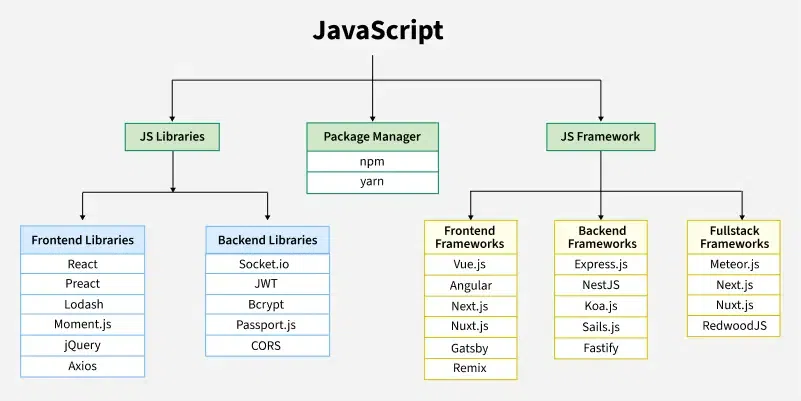

# JavaScript 
JavaScript is a programming language used to create dynamic content for websites. It is a lightweight, cross-platform, and single-threaded programming language. JavaScript is an interpreted language that executes code line by line providing more flexibility.

* HTML adds Structure to a web page, CSS styles it and JavaScript brings it to life by allowing users to interact with elements on the page, such as actions on clicking buttons, filling out forms, and showing animations.
* JavaScript on the client side is directly executed in the user's browser. Almost all browsers have JavaScript Interpreter and do not need to install any software. There is also a browser console where you can test your JavaScript code.
* JavaScript is also used on the Server side (on Web Servers) to access databases, file handling and security features to send responses, to browsers.


### **Hello World Program**
This JavaScript Compiler is completely free and easy to use. Here, you can practice various JS Exercises.

```bash 
console.log("Hello World!");
```

### **Why to learn JavaScript?**
* Versatility: JavaScript can be used to develop (using ElectronJS) websites, games (Using Phaser and Three.js), mobile apps (using React Native), and more.
* Client Side: JavaScript is the main language for client-side logic and is supported by almost all browsers. There is a big list of frameworks and libraries like React JS, Angular JS, and Vue JS.
* Server-Side: With runtime environments like Node.js and Frameworks like Express.js, JavaScript is now widely used for building server-side applications.
* Machine Learning: With Libraries like Tensorflow.JS, JavaScript can be used to develop and train machine learning models. Please refer to ML in JS for details.





## List of Companies Using JavaScript

These are some popular companies that use JavaScript in their workflow.

| Company   | Description |
|-----------|-------------|
| **Google** | Google uses JavaScript extensively in its web services, including Gmail and Google Maps. |
| **Facebook** | Facebook’s front-end is built with React, a JavaScript library, for a dynamic user interface. |
| **Netflix** | Netflix uses JavaScript for their interactive user interface and in their backend services. |
| **Airbnb** | Airbnb relies on JavaScript, using Node.js for scalable back-end development and React for the front end. |
| **LinkedIn** | LinkedIn uses JavaScript for both front-end and back-end development, enabling real-time interaction. |
| **Uber** | JavaScript is used by Uber for real-time tracking and routing, employing both front-end and back-end technologies. |
| **Twitter** | Twitter uses JavaScript for handling its dynamic feeds and providing a seamless user experience. |
| **PayPal** | PayPal’s front-end is powered by JavaScript, offering smooth, interactive user experiences. |
| **eBay** | eBay uses JavaScript to build their responsive, dynamic web applications and enhance user interactions. |
| **Slack** | Slack's web client and several of its real-time communication features are powered by JavaScript. |


## Applications of JavaScript
JavaScript is a versatile language that powers various applications, from web development to mobile apps, making it an essential tool for modern programming.

* Web Development: JavaScript is widely used in web development to create interactive and dynamic websites. Frameworks like React and Angular make front-end development faster, while Node.js is used for building server-side applications.
* Mobile App Development: JavaScript helps in developing mobile apps using frameworks like React Native, allowing developers to build cross-platform apps for both iOS and Android.
* Game Development: JavaScript is also used for creating browser-based games with libraries like Phaser, making it easy to develop 2D games that run directly in the browser.
* Server-Side Development: With Node.js, JavaScript is used for server-side programming, enabling developers to build scalable applications and APIs, especially for real-time features like chat systems.
* Scripting & Automation: JavaScript is ideal for automating web-related tasks like form validation and data manipulation, improving efficiency and reducing manual work.
* Web Scraping: JavaScript, along with libraries like Puppeteer, is used to extract information from websites for data analysis or research, making it useful for web scraping tasks.
* IoT (Internet of Things): JavaScript is used to control devices and sensors in IoT projects, allowing developers to build smart systems with frameworks like Johnny-Five.
* Real-Time Applications: JavaScript powers real-time applications, such as live chats or notifications, using technologies like WebSockets and Socket.io for instant communication between users and servers.

