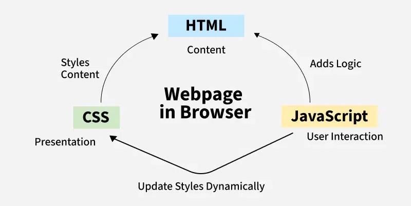

# JavaScript 
JavaScript is a programming language used to create dynamic content for websites. It is a lightweight, cross-platform, and single-threaded programming language. JavaScript is an interpreted language that executes code line by line providing more flexibility.

* HTML adds Structure to a web page, CSS styles it and JavaScript brings it to life by allowing users to interact with elements on the page, such as actions on clicking buttons, filling out forms, and showing animations.
* JavaScript on the client side is directly executed in the user's browser. Almost all browsers have JavaScript Interpreter and do not need to install any software. There is also a browser console where you can test your JavaScript code.
* JavaScript is also used on the Server side (on Web Servers) to access databases, file handling and security features to send responses, to browsers.




### **Hello World Program**
This JavaScript Compiler is completely free and easy to use. Here, you can practice various JS Exercises.

```bash 
console.log("Hello World!");
```

### **Why to learn JavaScript?**
* Versatility: JavaScript can be used to develop (using ElectronJS) websites, games (Using Phaser and Three.js), mobile apps (using React Native), and more.
* Client Side: JavaScript is the main language for client-side logic and is supported by almost all browsers. There is a big list of frameworks and libraries like React JS, Angular JS, and Vue JS.
* Server-Side: With runtime environments like Node.js and Frameworks like Express.js, JavaScript is now widely used for building server-side applications.
* Machine Learning: With Libraries like Tensorflow.JS, JavaScript can be used to develop and train machine learning models. Please refer to ML in JS for details.


